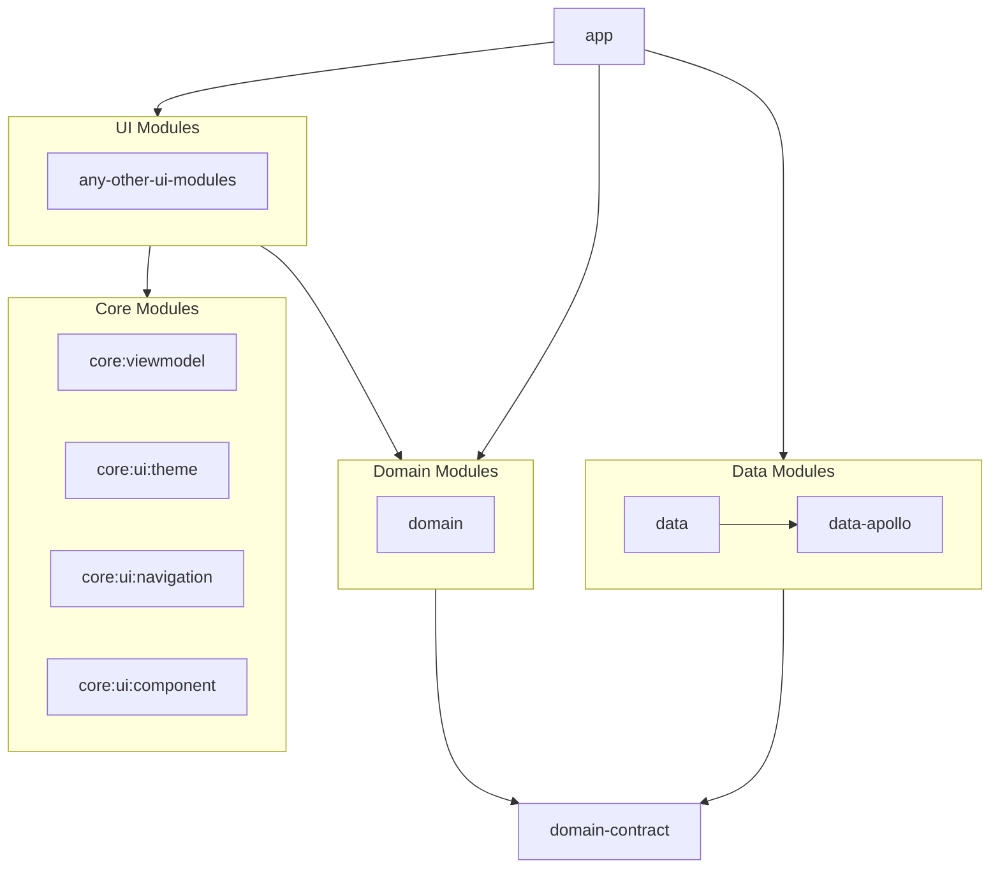

# Github & Good Practices App

This project is a sample Android application built to showcase modern Android development practices. It's designed to be a living project, continuously updated to reflect the latest trends and technologies in the Android ecosystem.

The application uses the GitHub GraphQL API to search for and display information about repositories.

## Key Technologies

This project is built with the following technologies:

*   **Kotlin**: The primary programming language for the application.
*   **Jetpack Compose**: For building the user interface.
*   **Koin**: For dependency injection.
*   **Apollo**: For interacting with the GitHub GraphQL API.
*   **Coil**: For image loading.
*   **Timber**: For logging.
*   **Detekt & Spotless**: For code quality.
*   **Danger (Work In Progress)**: For giving PR insight and niceties.

## Getting Started

To get started with this project, you'll need to add a GitHub personal token to the `gradle.properties`.

1.  Open `./gradle/gradle.properties`.
2.  Add the following line to the file, replacing `YOUR_API_KEY` with your actual GitHub personal token:

```
github.token=YOUR_API_KEY
```

## Building

To build the project, you can use the following command:

```bash
./gradlew build
```

## Project Structure

The project is divided into several modules, each with a specific responsibility.



### Module Descriptions

#### Data Modules

*   **data**: This module is responsible for orchestrating data from various sources, such as the network or a local database. It uses the `data-apollo` module to fetch data from the GitHub API.
*   **data-apollo**: This module provides a type-safe GraphQL client for the GitHub API using Apollo.

#### Domain Modules

*   **domain**: This module contains the business logic of the application. It defines the use cases and is interacted by the data layer through the `domain-contract` module.
*   **domain-contract**: This module defines the contracts (interfaces) for the domain layer.

#### Core Modules

*   **core:viewmodel**: This module provides base `ViewModel` implementations to be used by the UI modules.
*   **core:ui:theme**: This module contains the application's theme and styling information.
*   **core:ui:navigation**: This module provides the navigation component for the application.
*   **core:ui:component**: This module contains reusable UI components that are not specific to any particular feature.

#### UI Modules

*   **repo**: This module contains the UI for the repository search feature.

#### App

*   **app**: This is the main application module that brings everything together.

## Convention Plugins

This project uses convention plugins to simplify and standardize build configurations across modules. Instead of repeating the same setup in every `build.gradle.kts` file, we define it once in a plugin and apply it where needed. This makes our build scripts cleaner, more consistent, and easier to maintain.

The convention plugins are located [here](config/build-logic/convention) and are:

*   `AndroidConfigConventionPlugin`: Applies common Android configurations to all modules.
*   `AndroidDependenciesConventionPlugin`: Provides common dependencies to all modules.
*   `AndroidComposeConventionPlugin`: Configures Jetpack Compose for UI modules.
*   `AndroidUiConventionPlugin`: A combination of the above plugins, specifically for UI modules.
*   `CodeQualityConventionPlugin`: Configures Detekt and Spotless for code quality checks.

## Code Quality

This project uses [Detekt](https://detekt.dev/) and [Spotless](https://github.com/diffplug/spotless) to enforce code quality and style. The CI/CD pipeline is configured to run a code quality check on every pull request. **Pull requests will not be merged if the code quality check fails.**

To run all the code quality checks locally, you can use the following command:

```bash
./gradlew codeQualityCheck
```

This command will run `spotlessCheck`, `detekt`, and `lint` on all the modules.

To automatically format the code, you can run the following command:

```bash
./gradlew spotlessApply
```

It is recommended to run this command before pushing any changes to the repository.

## License

This project is licensed under the MIT License. See the [LICENSE](LICENSE) file for details.