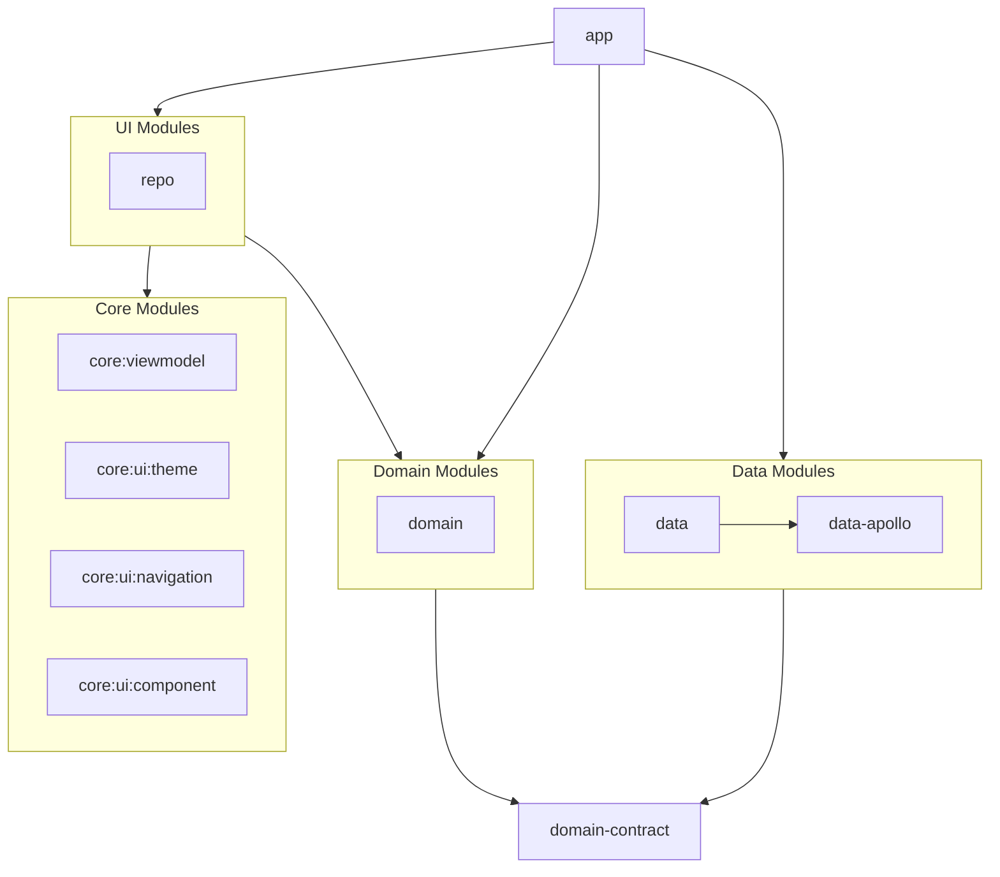

---- README is still in WIP ----

# TODO

- Unit Tests
- Add Bitrise & adds a Pull Request check step & release apk step

# Project Structure

## Module Descriptions

### Data Modules

- **data**: Main data layer implementation: is in charge to orchestrate **data-apollo** and other
  possible data source such as Room
- **data-apollo**: GraphQL client implementation

### Domain Modules

- **domain**: Business logic implementation
- **domain-contract**: Domain layer contracts/interfaces

### Core Modules

- **core:viewmodel**: Base ViewModel implementations
- **core:ui:theme**: UI theming and styling
- **core:ui:navigation**: Navigation components
- **core:ui:component**: Reusable UI components (not particularly related to specific UI)

### UI Modules

- **repo**: Repository related UI (components, screen)

### App

- **app**: Main application module
